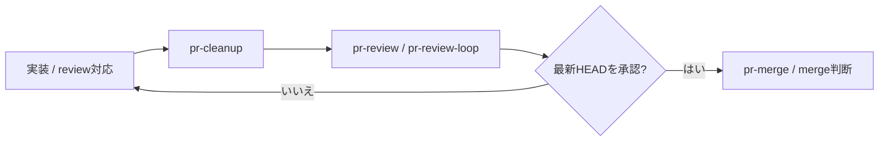
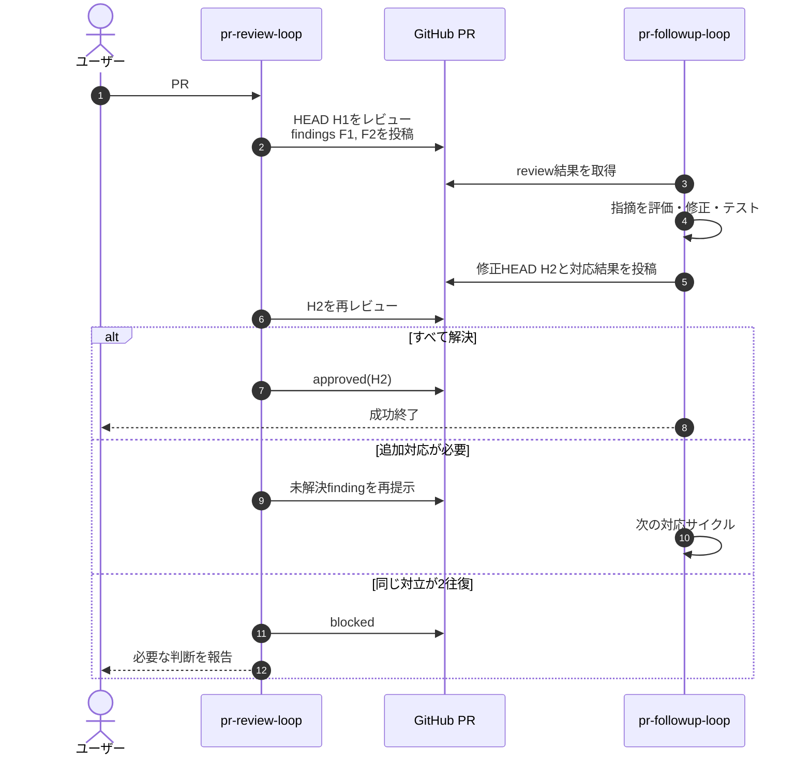

# Coding Agent Workflows

**Claude CodeとCodexで、PRのcleanup・レビュー・修正・再レビュー・承認までを安全に進めるGitHubワークフロー集です。**

[MIT License](LICENSE) · [ワークフロー設計](https://github.com/Mega-Gorilla/coding-agent-workflows/issues/1) · [移行ガイド](docs/migration.md)

単発のレビューだけでなく、次の更新を待つwatch、承認まで反復するloop、PRが新しく持ち込んだ技術負債を整理するcleanupを提供します。Claude CodeとCodexで同じSkill名とPR指定方法を利用できます。

```text
Claude Code: /pr-cleanup 32  → /pr-review-loop 32
Codex:      $pr-cleanup 32   → $pr-review-loop 32
```

## 特長

- **レビューから承認まで継続** — reviewとfollow-upを最新HEADへの承認まで反復できます。
- **指摘を確実に追跡** — `workflow_id`と`F1`、`F2`のような固定IDで、セッションをまたいで状態を引き継ぎます。
- **PR由来の技術負債を整理** — 不要ファイル、dead code、重複、過剰な抽象化、古い文書を最終レビュー前に確認できます。
- **Claude Code／Codex共通** — 呼び出し記号だけを変えて同じSkillを使用できます。
- **安全な停止条件** — 承認、権限不足、対立、timeout、最大サイクル到達を明確に区別します。

## 推奨フロー



### reviewとfollow-upの協調



## 収録Skill

| Skill | 用途 |
| --- | --- |
| `pr-cleanup` | PRが新しく導入した技術負債を確認し、安全な範囲でcleanup／refactorする |
| `pr-review` | 現在のHEADを一度レビューする |
| `pr-review-watch` | 次のレビュー対象を待ち、最大1回レビューする |
| `pr-review-loop` | 最新HEADの承認または停止条件までレビューを反復する |
| `pr-followup` | レビュー指摘を一度評価し、修正・検証・対応報告を行う |
| `pr-followup-watch` | 次のレビュー指摘を待ち、最大1回対応する |
| `pr-followup-loop` | 最新HEADの承認または停止条件まで対応を反復する |
| `pr-merge` | マージ前確認、マージ、関連Issueの更新を行う |
| `startup-status` | Issue、PR、CI、Git履歴からプロジェクト状況を要約する |

## 使い方

| 操作 | Claude Code | Codex |
| --- | --- | --- |
| PR #32をcleanup | `/pr-cleanup 32` | `$pr-cleanup 32` |
| PR #32を一度レビュー | `/pr-review 32` | `$pr-review 32` |
| 次の変更を一度レビュー | `/pr-review-watch 32` | `$pr-review-watch 32` |
| 承認までレビュー | `/pr-review-loop 32` | `$pr-review-loop 32` |
| 指摘へ一度対応 | `/pr-followup 32` | `$pr-followup 32` |
| 承認まで対応 | `/pr-followup-loop 32` | `$pr-followup-loop 32` |
| PRをマージ | `/pr-merge 32` | `$pr-merge 32` |

次のPR指定形式を共通で利用できます。

```text
32
#32
owner/repository#32
https://github.com/owner/repository/pull/32
```

引数なしの場合は、現在のbranchに対応するPRを解決します。

> Claude Codeの`/review`は組み込みaliasと衝突するため、共通名の`pr-review`を使用してください。

## watch／loop

- 開始直後に状態を確認し、変更がない間は既定60秒間隔でpollします。
- new HEADの検出後は、対応報告を最大2分待ってからレビューします。
- 進展を確認するたびに、次のサイクル期限として30分を確保します。変化のないpollや無効なイベントでは期限を延長しません。
- watchは最大1サイクル、loopは1回の呼び出しで最大30サイクルです。
- 最新HEADへの承認、`blocked`、`timeout`、`max_cycles`、PRのclose／mergeで終了します。`max_cycles`では新しいmarkerを投稿しないため、次の明示呼び出しで同じworkflowを継続できます。

## `pr-cleanup`

`pr-cleanup`は、PRが新しく導入した技術負債を最終レビュー前に整理します。

- 不要ファイル、debug出力、使われていないfixture
- 未使用関数、import、branch、古いcommentやTODO
- 重複処理、不要なwrapper、深すぎるfolder階層
- 複雑なcontrol flow、非効率なI/O、文書と実装の不一致

変更は対象PRとbehavior-preservingな範囲に限定します。所有者が不明なfile、大規模なarchitecture変更、公開contractの変更は自動実行せず、ユーザー判断へ返します。cleanup後のHEADは独立した`pr-review`で確認します。

## 安全性

- review系はコードを変更せず、follow-up／cleanup系は対象PRだけを変更します。
- 完全なHEAD SHA、投稿者の権限、コメントの編集状態を確認します。
- merge、force-push、branch削除、履歴改変は個別の明示依頼が必要です。
- 同じ指摘と反論が新しい根拠なしに2往復した場合は`blocked`で停止します。
- markerはbranch protectionや人間による承認を置き換えません。

## 必要なもの

- [Claude Code](https://code.claude.com/docs/en/overview)またはCodex
- [GitHub CLI (`gh`)](https://cli.github.com/)
- `git`
- GitHub CLIの認証（`gh auth login`）

## インストール

### Windows PowerShell 5.1 / PowerShell 7

```powershell
git clone https://github.com/Mega-Gorilla/coding-agent-workflows.git
cd coding-agent-workflows
./install.ps1
```

### macOS / Linux

```bash
git clone https://github.com/Mega-Gorilla/coding-agent-workflows.git
cd coding-agent-workflows
./install.sh
```

片方だけへインストールする場合:

```powershell
./install.ps1 -Target codex
./install.ps1 -Target claude
```

```bash
./install.sh --target codex
./install.sh --target claude
```

導入後は新しいagent sessionを開始してください。

## 更新・移行

変更せずに予定だけを確認できます。

```powershell
./install.ps1 -MigrateLegacy -WhatIf
```

```bash
./install.sh --migrate-legacy --dry-run
```

確認後、旧commands／Skillsをbackup付きで移行します。

```powershell
./install.ps1 -MigrateLegacy
```

```bash
./install.sh --migrate-legacy
```

復元方法は[移行ガイド](docs/migration.md)を参照してください。

## License

[MIT](LICENSE)
